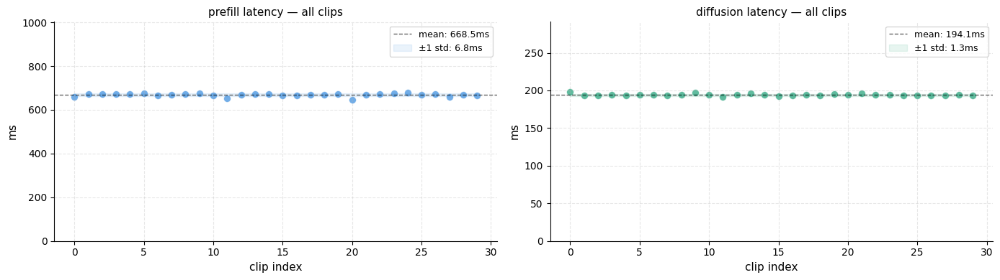
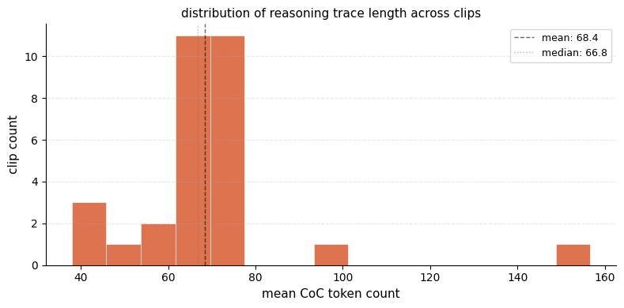
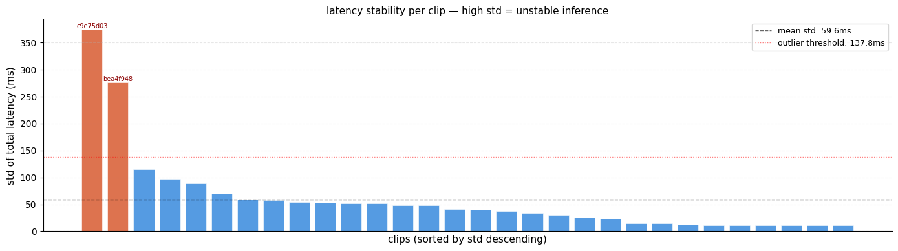
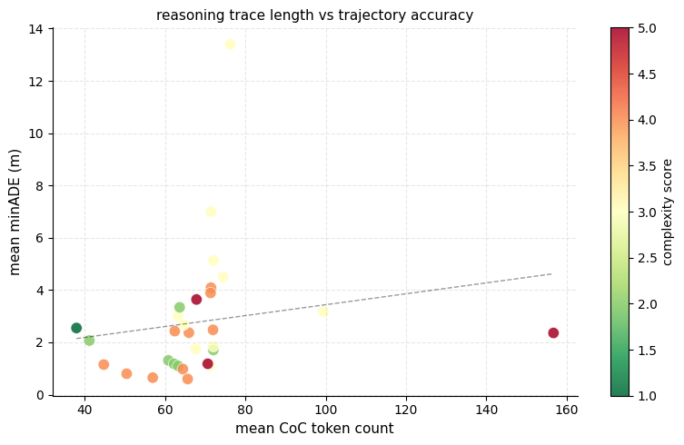

# Alpamayo Edge Inference Optimization and Benchmarking
Performance analysis and optimization of NVIDIA's Alpamayo VLA model for edge deployment. Testing conducted on NVIDIA RTX 6000 Ada.

## Motivation
NVIDIA's Alpamayo (nvidia/Alpamayo-1.5-10B) is a vision-language-action model for autonomous vehicle decision-making. This project benchmarks its inference performance on edge hardware and explores optimization strategies for real-time deployment. the current findings suggest that the autoregressive decoder is the most dependent on the complexity of the scene and is the biggest bottleneck. The prefill which is the vision encoder although a bottleneck is pretty standard across all clip types.


## Repository Structure
```
alpamayo-inference-benchmark/
├── benchmark_scripts/          # Benchmark scripts and data
│   ├── core.py                 # Core benchmarking functions
│   ├── run_suite.py            # Main script to run benchmarks
├── configs/                    # YAML configurations
│   ├── baseline.yaml           # Baseline benchmark config
│   └── complexity_analysis.yaml # Complexity analysis config
├── results/                    # Raw data and analysis outputs
│   ├── baseline_results.txt    # Baseline results
│   ├── profiling_summary.csv   # Profiling summaries
│   └── timing_iter.csv         # Timing data per iteration
├── visualisation_scripts/      # Visualization scripts
│   └── result_visualization.ipynb # Notebook for result visualization
├── requirements.txt            # Python dependencies
└── README.md
```

## Hardware

- **Workstation**: NVIDIA RTX 6000 Ada (48GB)
- **Edge target**: NVIDIA Drive Thor (planned)

## Setup

**Prerequisites:**
- NVIDIA GPU with CUDA support
- Python 3.10+
- Access to nvidia/Alpamayo-R1-10B model

1. **Install Alpamayo:**
```bash
   git clone https://github.com/NVlabs/alpamayo.git
   cd alpamayo
```
Follow the Install instructions from Alpamayo repository

**Install dependencies:**
```bash
cd ../alpamayo-inference-benchmark
pip install -r requirements.txt
```

**Download model** (happens automatically on first run):
```bash
python benchmark_scripts/run_suite.py
```

## Usage

Run baseline latency benchmark:
```bash
python benchmark_scripts/run_suite.py --config configs/baseline.yaml
```

Run complexity analysis benchmark:
```bash
python benchmark_scripts/run_suite.py --config configs/complexity_analysis.yaml
```

## Visualization

Use the provided Jupyter notebooks for data analysis and result visualization:

- `visualisation_scripts/result_visualization.ipynb`: Visualize results and profiling data

## Results

### Baseline Latency (100 iterations)

| Metric | Value |
|--------|-------|
| Mean   | 1321.59ms |
| Std    | 58.55ms |
| p50    | 1329.41ms |
| p95    | 1417.09ms |
| p99    | 1422.22ms |
| Min    | 1136.41ms |
| Max    | 1433.22ms |

### Component Breakdown

The total inference pipeline consists of three main stages: prefill (vision encoder), autoregressive decode (LLM/CoC reasoning), and diffusion (trajectory generation).

| Component | Mean Latency | Std |
|-----------|-------------|-----|
| Prefill (vision encoder) | 668.5ms | ±6.8ms |
| Autoregressive decode | 246–794ms | varies with complexity |
| Diffusion (trajectory) | 194.1ms | ±1.3ms |

**Key finding:** Prefill and diffusion latencies are highly stable and scene-independent. The autoregressive decode is the primary bottleneck and scales with scene complexity — ranging from ~246ms (complexity 1) to ~794ms (complexity 5).

### Complexity vs. Autoregressive Latency

Across 30 clips (10 iterations each), the autoregressive decoder shows a strong dependence on Chain-of-Thought (CoC) token length, which correlates with scene complexity:

| Complexity | Example clip | Mean autoregressive (ms) | Mean CoC tokens |
|------------|-------------|--------------------------|-----------------|
| 1 | efc00ec5 | 246ms | 37.9 |
| 2–3 | (typical) | ~350–400ms | ~60–75 |
| 5 (outlier) | c9e75d03 | 794ms | 156.7 |



### Reasoning Trace Length

CoC token count across clips follows a right-skewed distribution:
- **Mean:** 68.4 tokens
- **Median:** 66.8 tokens
- Most clips cluster between 60–75 tokens; one outlier reaches ~157 tokens



### Latency Stability

Per-clip latency standard deviation (std of total latency across iterations) has a mean of 59.6ms. Two clips exceed the outlier threshold of 137.8ms:
- **c9e75d03** (complexity 5): std ~370ms — highly unstable, driven by variable autoregressive decode length
- **bea4f948** (complexity 3): std ~275ms



### Reasoning Trace vs. Trajectory Accuracy

Longer CoC reasoning traces (more tokens) show a weak positive correlation with higher minADE (worse trajectory accuracy), though high-token clips at complexity 5 can still achieve low error. Scene complexity (color) is a stronger predictor of error than token count alone.



## References

- [Alpamayo GitHub](https://github.com/NVlabs/alpamayo)
- [PhysicalAI-AV Dataset](https://huggingface.co/datasets/nvidia/PhysicalAI-Autonomous-Vehicles)

